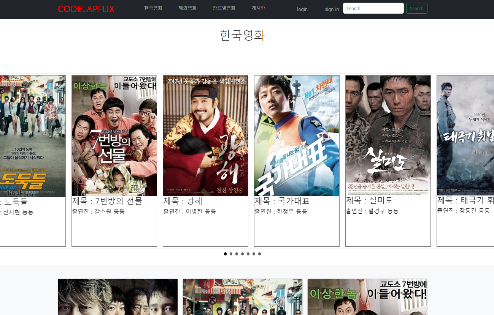
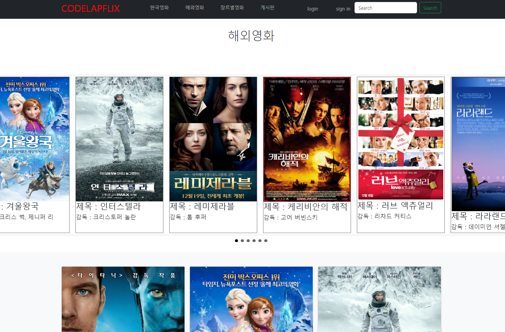

# CodeLab-Movie 
## 목차

### 팀원소개
    
 |  이름  | 보유기술 | 개발환경 | 수학성적 |
|--------|----------|----------|----------|
| 정승호 |    HTML, javascript, css    |    79    |    80    |
| 이정훈 |    HTML, javascript, css    |    79    |    80    |
| 김정승 |    HTML, javascript, css    |    79    |    80    |
| 배은지 |    HTML, javascript, css    |    79    |    80    |
    
### 프로젝트개요

    테마별로 영화를 소개하는 웹서비스

### 담당업무

     -정승호 -  
   ***
     -이정훈 -  
        + 영화 장르별 포스터 사진파일 다운로드 후 배열에 저장
        + 영화 예고편 url 주소 다운로드 후 배열에 저장
        + 영화 줄거리 소개하는 텍스트파일 다운로드 후 배열에 저장
   *** 
     -김정승 - 
        + chatBot 개발 및 프로그램 구성
        + 조원개발 파일 취합 및 배포
   ***
     -배은지 - 
         + 자료조사 
         + 프론트 디자인 

### 주요기능 
     -정승호 -  
   ***
     -이정훈 -  
         + 배열에 영화 별 사진, url 주소, 줄거리 소개 입력 후
         + 메인 페이지에서 해당 정보를 끌어다 쓸 수 있게 저장 함

         
   *** 
     -김정승 - 
    
   ***
     -배은지 - 
         + 자료조사 
         + 프론트 디자인

### 향후과제
    + 프로젝트 과제

    + 조원별 개인 과제
    
     -정승호 -  
   ***
     -이정훈 -  
         jQuery 함수 사용에 미흡함을 느낌
         전반적인 프로젝트 완성에 도움을 못 줌
         jQuery 문법에 능통한 개발 능력을 갖추기를 희망함
   *** 
     -김정승 - 
   ***
     -배은지 - 
         전체적인 퀄리티를 업그레이드, 프론트에만 포커스를 맞춘 웹을 백엔드 부분도 접목시켜 현실적인 구동능력을 넣고싶습니다.
